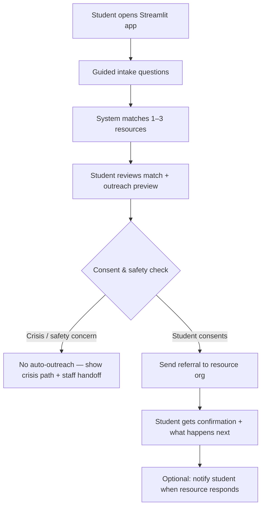
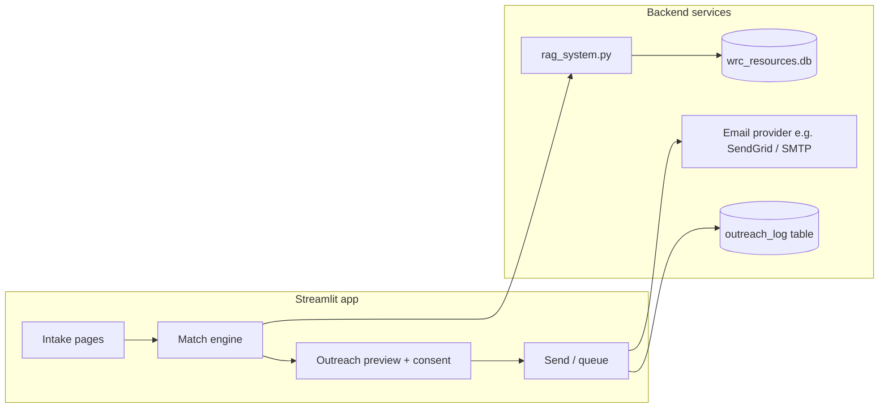

# WRC Intake & Automated Resource Outreach — Project Plan & Scope

## Executive summary

The WRC Resource Search tool helps students **find** support. The next phase keeps everything in **Streamlit** and shifts away from full case-management (saved plans, staff dashboards, document exports).

Instead, the system will:

1. **Ask structured questions** about the student’s situation and needs
2. **Match** them to the best resources from `wrc_resources.db` (using existing RAG search)
3. **Reach out to those resources on the student’s behalf** — starting with a consent-based referral message — so the student is not left to make the first contact alone

This document defines scope, open questions, phases, and safety constraints so the outreach feature can be designed responsibly before any code is written.

---

## Why this direction instead of case management?

| Case management (previous plan) | Intake + outreach (this plan) |
| --- | --- |
| Student downloads a plan and calls agencies themselves | WRC/system initiates contact with the agency |
| More tracking, storage, and staff workflow | Lighter footprint; focus on removing the “first call” barrier |
| Student still does the outreach | Student gets a warm handoff: “Someone is expecting you” |

Many students stall at the **first contact** — not knowing what to say, fear of rejection, language barriers, or trauma. Automating (or semi-automating) that first outreach can be more impactful than giving them another PDF.

---

## Problem statement

Students leave the WRC with resource names but still face:

- **Cold-call anxiety** — “What do I even say?”
- **Eligibility uncertainty** — they don’t know if they qualify before calling
- **Capacity limits** — students may not have time or privacy to call during agency hours
- **Follow-through gap** — especially for housing, legal, and childcare where the first contact matters

Staff cannot make every referral call during drop-in hours. A guided intake that produces a **consented, templated outreach** to the right resource extends WRC support while keeping humans in the loop where safety requires it.

---

## Core user journey



### What “reach out on the student’s behalf” means

**In scope (realistic MVP):**

- Send a **referral email** from a WRC-controlled address (e.g. `wrc-referrals@ccsf.edu`) to the resource organization’s listed email
- Email includes only **student-approved** information (name, contact method, need summary, CCSF student status if relevant)
- Standard WRC referral template: who referred, what the student needs, how the agency should follow up **with the student directly**
- Log that outreach was sent (timestamp, resource ID — minimal metadata)

**Semi-automated (recommended for MVP):**

- Student completes intake → staff or peer counselor **reviews and approves** send (one-click)
- Reduces errors and protects survivors in sensitive cases

**Out of scope for MVP:**

- Robocalls or AI phone calls to agencies
- Submitting web forms on third-party sites (fragile, often blocked)
- Pretending to be the student (must be transparent WRC referral)
- Auto-outreach for **crisis/DV** intakes without mandatory staff review

---

## Intake questionnaire design

The intake is **not** a clinical assessment. It gathers enough to match resources and draft outreach.

### Section 1 — Primary need

- What do you need help with? (housing, safety, legal, food, childcare, health, employment, education, financial, other)
- How urgent is this? (crisis / this week / planning ahead)

### Section 2 — Situation context

- Are you a CCSF student? (yes / no / prefer not to say)
- Do you have dependents / children?
- Housing status (stable, temporary, unhoused, at risk of eviction)
- Employment status (optional)
- Any deadlines? (e.g., court date, lease end, school start)

### Section 3 — Outreach preferences

- **Preferred contact method for the agency to reach you:** phone / email / either
- **Best time to reach you** (optional)
- **Safe contact note:** “Only call after 5pm” / “Do not leave voicemail” / “Email only”
- **Language preference** for follow-up

### Section 4 — Consent (required before send)

- [ ] I authorize WRC to contact the organization(s) below with the information I reviewed
- [ ] I understand WRC is making a **referral**, not guaranteeing services
- [ ] I have reviewed the message preview and it is accurate
- [ ] For safety intakes: additional acknowledgment if partner monitoring is a concern

### Section 5 — Free text (optional, capped)

- “Anything else we should include?” (500 char limit; warn that this goes to the agency)

**Design principle:** Every field should map to either **resource matching** or **outreach template slots**. No “nice to have” questions that don’t change outcomes.

---

## Resource matching (reuse existing stack)

Matching builds on what already exists:

| Component | Role |
| --- | --- |
| `rag_system.py` | Semantic search from intake summary |
| Priority tiers in RAG | CCSF reporting, crisis hotlines, campus resources first when relevant |
| `database.py` | Contact info, eligibility, hours |

**Intake → search query:** Combine primary need + urgency + 1–2 context fields into a natural-language query (rule-based or LLM-assisted).

**Output:** Top 1–3 resources, ranked. Student confirms which to contact (default: top match only; optional second choice if first is waitlisted).

### Data reality check

Current database coverage (approximate):

| Contact method | Current resources |
| --- | --- |
| Has email | ~25% (~188 of 756) |
| Has phone | ~57% (~434 of 756) |

**Implication:** Email outreach alone will not cover all resources. The plan must handle:

- **Email available** → automated/semi-automated send
- **Phone only** → generate a **call script + click-to-call** for student *or* queue for staff to call
- **No contact** → flag for WRC staff manual follow-up

This should be surfaced honestly in the UI: *“This organization can’t receive automated email — here’s how we’ll help instead.”*

---

## Outreach message template (draft)

```
Subject: CCSF Women's Resource Center referral — [Need type] support requested

Hello [Organization name],

The Women's Resource Center at City College of San Francisco is referring a 
student who has asked for help with [primary need].

Student has authorized us to share the following:

  Name: [Student name — or first name only, per policy]
  Preferred contact: [phone/email] — [safe contact notes]
  Need summary: [2–4 sentences from intake, student-approved]
  Urgency: [crisis / this week / planning]
  CCSF student: [yes/no if shared]

The student is aware you may follow up directly. Please reply to this email 
or contact the student using the method above.

If your program is not accepting referrals or the student is not eligible, 
a brief reply helps us redirect them.

Thank you for the work you do in our community.

[Staff name / WRC generic signature]
Women's Resource Center, City College of San Francisco
[Phone / room / hours]
```

**Student sees full preview and can edit the “Need summary” block before send.**

---

## Safety & privacy rules (non-negotiable)

Women’s Resource Center work intersects **FERPA**, **Title IX**, and **survivor safety**.

| Scenario | Rule |
| --- | --- |
| Domestic violence / partner monitoring | **No auto-send.** Show crisis resources; staff-only outreach or student-initiated contact |
| Sexual assault / Title IX | Surface Title IX first; outreach may require staff review |
| Student under 18 | Staff review required |
| Student declines to share name | Send referral with first name only or “WRC student” + contact method, per policy |
| Wrong email in database | Confirm email domain looks valid; flag low-confidence contacts |
| Agency is a hotline (SFWAR, etc.) | **Never email a hotline for a student.** Show number; student calls or staff assists in person |

**Default posture:** Semi-automated (staff approval) until WRC leadership signs off on fully automated sends for low-risk categories (e.g., food pantry, childcare waitlist).

---

## Architecture (Streamlit-only)



### Suggested module layout

```
intake/
  questions.py       # Intake schema, validation, urgency flags
  matcher.py         # Intake → RAG query → ranked resources
  outreach.py        # Template rendering, consent checks
  safety.py          # Block auto-send rules
  email_sender.py    # SMTP / SendGrid integration
pages/
  1_Resource_Search.py    # Existing search (refactor from app.py)
  2_Get_Help.py           # Intake wizard
  3_Review_and_Send.py    # Preview + consent + send/queue
```

### New database table (minimal)

```sql
CREATE TABLE outreach_log (
  outreach_id INTEGER PRIMARY KEY,
  resource_id INTEGER,
  sent_at TIMESTAMP,
  status TEXT,              -- queued, sent, failed, staff_review, blocked_safety
  intake_summary_hash TEXT, -- no full PII if policy requires
  student_contact_method TEXT,
  approved_by TEXT          -- 'student_self' or 'staff:user_id'
);
```

Store **minimal** metadata unless CCSF policy allows more. Full intake text should not live in logs long-term without review.

---

## Functional requirements

### Phase 1 — Intake + match (no send yet)

- [ ] Multi-step intake form in Streamlit
- [ ] Intake → RAG query generation
- [ ] Show top 1–3 matches with “why this resource”
- [ ] Outreach preview (read-only) so stakeholders can review copy
- [ ] Safety rules block preview-send for crisis intakes

**Acceptance:** Student completes intake and sees recommended resources + draft referral email text.

### Phase 2 — Semi-automated outreach (staff-approved send)

- [ ] Student consent flow + editable need summary
- [ ] Staff approval queue (simple list in Streamlit, password or CCSF login TBD)
- [ ] Send email via WRC SMTP / SendGrid
- [ ] Student confirmation screen: “We contacted [org]; expect follow-up in X days”
- [ ] `outreach_log` table
- [ ] Phone-only fallback: call script for student or “WRC will call within 24h” staff task

**Acceptance:** End-to-end referral email sent for a food/housing resource with staff approval.

### Phase 3 — Student notifications & iteration

- [ ] Email copy to student (“We sent this on your behalf”)
- [ ] Optional: inbound reply parsing (“Agency said they’ll call you Tuesday”)
- [ ] Template library by need type (housing, legal, childcare)
- [ ] Track which resources respond / bounce (operational, not student-facing CRM)

### Phase 4 — Scale & policy (only after review)

- [ ] Auto-send without staff for low-risk categories
- [ ] CCSF SSO for staff queue
- [ ] Multilingual intake and outreach templates

---

## Open questions for WRC / CCSF stakeholders

These should be answered **before** Phase 2 goes live:

### Outreach mechanics

1. **Sending identity:** Should emails come from a shared WRC inbox, a staff member’s address, or `noreply@` with reply-to set to WRC?
2. **Student identity:** Full name, first name only, or student ID?
3. **Student contact in referral:** Include student phone/email directly, or ask agency to contact WRC first?
4. **Staff approval:** Is every referral staff-approved, or only safety-tagged intakes?
5. **Volume:** How many automated referrals per week can partner agencies realistically absorb?

### Legal & compliance

6. Does CCSF IT allow **SendGrid / SMTP** from Streamlit Cloud, or must this run on-campus?
7. Is this **FERPA** “directory information” or does it require separate consent forms?
8. Do any partner agencies **prohibit** third-party referrals by email?
9. Retention: How long do we keep `outreach_log` records?

### Safety

10. For DV intakes, is **any** automated message to an outside agency acceptable, or always in-person/staff call?
11. Should the app include a **quick exit** and session clear (standard for survivor tools)?
12. What happens if the student’s abuser monitors email — is email outreach ever allowed?

### Operational

13. Who monitors the WRC inbox for agency replies?
14. What is the **SLA** for staff to approve queued referrals (same day? 24h?)?
15. When email is missing (~75% of resources), is the fallback **staff phone call** or **student call script**?
16. Should we **verify** agency emails periodically (many binder entries may be stale)?

---

## Success metrics

| Metric | Target |
| --- | --- |
| Intake completion rate | >60% of students who start intake |
| Match relevance (staff spot-check) | >80% “appropriate resource” |
| Outreach sent within 24h of intake | >90% (with staff approval model) |
| Student follow-through | Track whether student reports agency contact (optional survey) |
| Safety incidents from auto-outreach | Zero — any breach triggers immediate manual-review-only mode |

---

## Risks & mitigations

| Risk | Mitigation |
| --- | --- |
| Stale/wrong emails in database | Validate format; staff review; periodic verification |
| Only ~25% of resources have email | Phone fallback + prioritize email-capable orgs in matching when outreach is goal |
| Student PII sent inappropriately | Preview + consent; minimal fields; staff approval |
| Agency overload / spam perception | Rate limits; one referral per student per need; clear WRC signature |
| Streamlit Cloud email restrictions | Confirm with CCSF IT early; may need on-prem or serverless function |
| Survivor safety | Hard blocks on auto-send for flagged intakes |

---

## What we are explicitly not building

- GitHub Pages / static site (Streamlit only)
- Full case-management CRM with notes, assignments, and document vaults
- AI phone calls to agencies
- Guaranteed placement or eligibility determination
- Long-term storage of sensitive narratives without policy sign-off

---

## Recommended next steps

1. **Review this plan with WRC leadership** — especially the open questions above
2. **Answer sending identity and consent policy** with CCSF legal/IT
3. **Phase 1 implementation:** intake wizard + match preview in Streamlit (no email yet)
4. **Pilot with 2–3 email-friendly partners** (e.g., food, housing, childcare orgs with known inboxes)
5. **Measure staff time saved** vs. students making cold calls themselves

---

## Summary

The next evolution of the WRC Resource Search app is a **Streamlit intake assistant** that understands the student’s needs, finds the right resource, and **makes the first contact for them** — with clear consent, safety guardrails, and staff oversight where it matters. That removes the hardest step for many students while staying lighter than a full case-management system.

When you’re ready to build, Phase 1 (intake + match + outreach preview, no send) is the right place to start — it delivers value immediately and forces the stakeholder conversations this feature requires.
