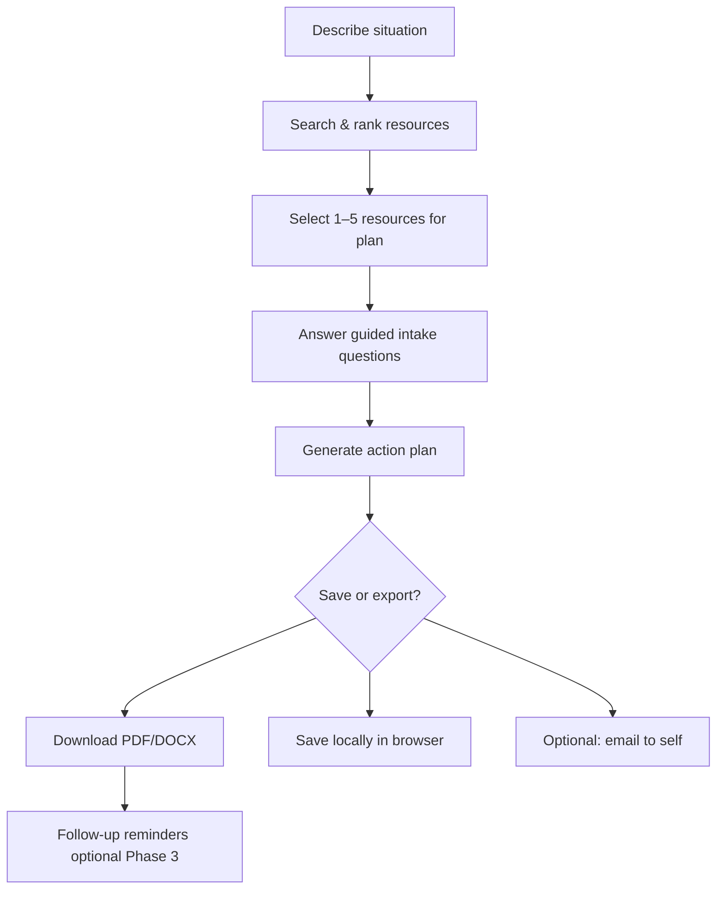
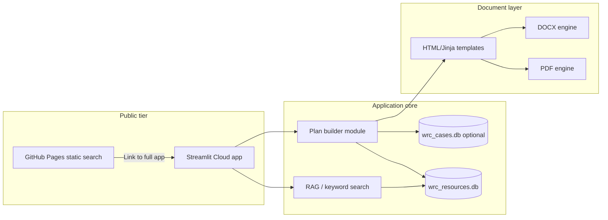

# WRC Case Management System — Project Plan & Scope

## Executive summary

The WRC Resource Search tool helps people **find** support. The next phase adds a **case-management layer** so users can turn search results into a **personalized action plan**: who to contact, in what order, with what to say, and what documents or steps they may need — then **save and download** that plan as a document they can keep, print, or share with a trusted advocate.

This document defines scope, phases, architecture, and success criteria so the case-management system can be built incrementally without blocking the already-deployed resource search engine.

---

## Problem statement

Students and community members facing housing instability, safety concerns, legal issues, childcare gaps, or financial stress often leave the WRC with a **list of resources** but not a **plan**. They still have to figure out:

- Which organization to call first
- What information to gather before calling
- Whether they meet eligibility requirements
- What to do if the first option does not work
- How to track follow-ups across multiple agencies

Staff time is limited, and not everyone can sit down for a full intake. A guided, self-service case-plan builder — grounded in verified WRC resource data — extends WRC support beyond office hours.

---

## Goals

| Goal | Measure of success |
| --- | --- |
| Reduce friction from “found a resource” to “know my next step” | Users can generate a plan in under 10 minutes |
| Preserve WRC trust and safety priorities | Crisis and CCSF reporting paths are surfaced first when relevant |
| Support staff workflow, not replace it | Plans can be reviewed, printed, or handed off to a counselor |
| Respect privacy | No account required for MVP; sensitive data stays client-side or minimally stored |
| Build on existing data | Reuse `wrc_resources.db`, RAG search, and GitHub Pages / Streamlit stack |

## Non-goals (initial release)

- Full CRM replacement for WRC staff (Salesforce, case notes, billing)
- Automated outbound calling or messaging to third-party agencies
- Legal advice generation — the system suggests **resources and steps**, not legal conclusions
- Long-term storage of highly sensitive survivor narratives without explicit consent and security review

---

## User personas

### 1. Student in crisis (primary)

Needs immediate, ordered steps — e.g., unsafe housing, DV, food insecurity. May be on a phone, stressed, limited time. Plan must be short, clear, and printable.

### 2. Student planning ahead (secondary)

Exploring childcare, financial aid, or employment support. Wants a checklist over several weeks.

### 3. WRC peer counselor / staff (internal)

Uses the tool during drop-in hours to co-create a plan with a student, then exports PDF for the student’s folder or follow-up appointment.

### 4. Community partner (tertiary)

Referral partner who needs a standardized handoff document listing verified contacts and next steps.

---

## Core user journey



### Step 1 — Situation intake

Short, plain-language form (not a clinical assessment):

- **Primary need** (housing, safety, legal, food, childcare, health, employment, education, other)
- **Urgency** (crisis / this week / planning ahead)
- **Constraints** (CCSF student, parent, immigration concern, disability access, language preference)
- **Location** (SF neighborhood or “can travel / remote OK”)
- **Optional free text** (“I was evicted and have a child starting school Monday”)

Intake drives search weighting and plan language — it does **not** need to be stored server-side in MVP.

### Step 2 — Resource selection

- Start from search results (keyword on GitHub Pages, semantic on Streamlit)
- User **pins** resources into “My plan”
- System suggests a **recommended order** based on:
  - Existing priority tiers (CCSF reporting, crisis hotlines, CCSF campus, community)
  - Urgency and resource type fit
  - Hours / walk-in vs appointment

### Step 3 — Guided action steps (per resource)

For each selected resource, generate:

| Field | Example |
| --- | --- |
| Why this resource | “Offers emergency shelter intake for families” |
| Who to contact | Organization name, phone, email, hours |
| What to say | Short script: “I’m a CCSF student looking for…” |
| What to bring | ID, proof of enrollment, lease, etc. |
| Eligibility check | Bullet summary from resource record |
| If this doesn’t work | Next alternate from search or staff referral |
| Safety note | e.g., “Use a safe phone if concerned about partner monitoring” |

Templates are **rule-based + LLM-assisted** (Streamlit/full app), with staff-reviewed boilerplate for high-risk categories (DV, Title IX).

### Step 4 — Plan document export

Downloadable **Action Plan** document containing:

- Cover: situation summary (user-approved text), date, WRC branding
- Priority call list (ordered)
- Per-resource contact blocks
- Checklist of actions with checkboxes
- Disclaimer: informational, not legal/medical advice
- WRC contact info and crisis numbers footer

**Formats:**

| Phase | Format | Notes |
| --- | --- | --- |
| MVP | PDF | ReportLab or WeasyPrint from HTML template |
| MVP+ | DOCX | `python-docx` for editability |
| Later | Accessible HTML | Print-friendly, screen-reader friendly |

### Step 5 — Save & resume (phased)

| Phase | Capability |
| --- | --- |
| Phase 1 | Download only; plan lives in browser session |
| Phase 2 | Save plan JSON in `localStorage` (anonymous, device-bound) |
| Phase 3 | Optional account or staff “case ID” for return visits |
| Phase 4 | Staff dashboard for authorized WRC users |

---

## Functional requirements

### Must have (Phase 1 — MVP)

1. **Plan builder UI** in Streamlit (primary) with link from GitHub Pages static site
2. Situation intake form with urgency and need type
3. Add/remove resources from a plan cart
4. Auto-generated ordered steps per resource using templates
5. PDF download of complete plan
6. Crisis/CCSF resources cannot be omitted from safety-relevant intakes without explicit user acknowledgment
7. Clear disclaimers on every export

### Should have (Phase 2)

1. DOCX export
2. localStorage save/resume (no login)
3. “Email plan to myself” (via transactional email service)
4. Staff-reviewed template library for common scenarios (housing, DV, childcare)
5. Plan preview before download
6. Print stylesheet

### Could have (Phase 3)

1. Authenticated student/staff accounts (SSO with CCSF if available)
2. Staff case list with status (draft, shared, closed)
3. Follow-up reminders (email/SMS opt-in)
4. Multilingual plan generation (English, Spanish, Chinese — aligned with CCSF demographics)
5. Integration with WRC appointment scheduling

### Won’t have initially

- Automated eligibility verification with external agencies
- Two-way sync with county systems
- Storing full narrative intake in cloud without FERPA/privacy review

---

## Data model extensions

New tables in SQLite (or separate `wrc_cases.db` for separation):

```sql
-- Anonymous or authenticated case shell
CREATE TABLE cases (
  case_id TEXT PRIMARY KEY,
  created_at TIMESTAMP,
  updated_at TIMESTAMP,
  created_by TEXT,           -- 'anonymous', 'student', 'staff:user_id'
  status TEXT,               -- draft, exported, archived
  intake_json TEXT,          -- structured situation answers
  plan_title TEXT
);

-- Ordered resources attached to a case
CREATE TABLE case_resources (
  case_id TEXT,
  resource_id INTEGER,
  sort_order INTEGER,
  user_notes TEXT,
  PRIMARY KEY (case_id, resource_id),
  FOREIGN KEY (resource_id) REFERENCES resources(resource_id)
);

-- Generated action steps (editable before export)
CREATE TABLE case_actions (
  action_id INTEGER PRIMARY KEY,
  case_id TEXT,
  resource_id INTEGER,
  step_order INTEGER,
  action_type TEXT,          -- call, visit, gather_docs, safety, follow_up
  title TEXT,
  body TEXT,
  completed INTEGER DEFAULT 0
);

-- Export audit (no PII in logs if possible)
CREATE TABLE case_exports (
  export_id INTEGER PRIMARY KEY,
  case_id TEXT,
  format TEXT,
  exported_at TIMESTAMP
);
```

**Privacy note:** Intake free text may contain PII. MVP should default to **client-side assembly** of the export payload; server stores only opaque case IDs if persistence is needed.

---

## Architecture



### Recommended module layout

```
case_management/
  __init__.py
  intake.py          # Situation schema, validation, urgency rules
  plan_builder.py    # Order resources, attach templates
  templates/         # Jinja2 HTML for PDF/DOCX
  exporters/
    pdf_exporter.py
    docx_exporter.py
  safety_rules.py    # Crisis routing, mandatory warnings
  storage.py         # Case CRUD (Phase 2+)
pages/
  1_Resource_Search.py   # Existing search (refactor from app.py)
  2_My_Action_Plan.py    # New plan builder
  3_Saved_Plans.py       # Phase 2
```

Streamlit **multipage app** keeps search and case planning separate but connected.

---

## AI usage boundaries

| Use AI | Do not use AI |
| --- | --- |
| Rephrase intake into plan summary (user approves before export) | Diagnose legal or medical situations |
| Draft “what to say” phone scripts from resource metadata | Invent eligibility rules not in database |
| Suggest alternate resources when first choice is weak match | Override mandatory crisis routing |

All LLM output should cite **resource IDs** from the database. Staff template fallbacks apply when API is unavailable.

---

## Security, privacy & compliance

Women’s Resource Center work intersects **FERPA**, **Title IX**, and **survivor privacy**.

| Requirement | Approach |
| --- | --- |
| Minimize stored PII | Client-side plan assembly in MVP; optional server save later |
| Consent | Checkbox before export: “This plan may contain personal details — store safely” |
| Crisis paths | Hard-coded priority for Title IX, SFWAR, CCSF Police when intake flags safety |
| Access control | Staff-only case lists behind auth in Phase 3 |
| Audit | Log exports, not full intake text, unless staff case management is enabled |
| Data retention | Auto-delete draft cases after 30 days (configurable) |

Legal review recommended before storing intake narratives on any server.

---

## UI/UX principles

1. **Warm, calm visual language** — reuse existing WRC purple/cream design system
2. **One primary action per screen** — “Add to plan”, “Download plan”
3. **Progress indicator** — Intake → Pick resources → Review → Download
4. **Safety exit** — quick link to leave site / clear session (common in DV contexts)
5. **Low literacy friendly** — short sentences, icons, optional audio later
6. **Mobile first** — many students will use phones

---

## Implementation phases

### Phase 0 — Foundation (current + GitHub Pages) ✅

- [x] Resource database and search
- [x] Streamlit app with AI search
- [x] Static GitHub Pages deployment
- [x] Export script for JSON index

**Deliverable:** Public search at `https://madiraa.github.io/wrc-resource-search/`

### Phase 1 — Plan builder MVP

**Scope:** Streamlit-only; PDF export; session-based plans

| Work item | Details |
| --- | --- |
| Intake form | Need, urgency, constraints |
| Plan cart | Add from search results |
| Step generator | Rule-based templates per resource type |
| Safety rules | Mandatory crisis block for DV/urgent safety intake |
| PDF export | Branded template with contacts and checklists |
| Link from static site | “Build an action plan” → Streamlit URL |

**Acceptance criteria:**

- User completes intake, selects 3 resources, downloads PDF in one session
- PDF includes ordered call list and per-org steps
- Safety intake cannot finish without surfacing crisis/CCSF reporting options

### Phase 2 — Persistence & staff readiness

| Work item | Details |
| --- | --- |
| localStorage / optional case ID | Resume plan on same device |
| DOCX export | Editable for counselors |
| Template library | Staff-editable YAML/JSON templates |
| Email to self | SendGrid or similar |
| Plan preview page | Edit steps before export |

### Phase 3 — Case management for WRC staff

| Work item | Details |
| --- | --- |
| Staff auth | Google/CCSF SSO or simple role table |
| Case dashboard | List, filter, assign, archive |
| Notes & status | Internal only, separate from student export |
| Follow-up reminders | Optional email |
| Analytics | Aggregate counts (not content): plans by need type |

### Phase 4 — Integrations & polish

- Calendar links for appointments
- Multilingual exports
- Accessibility audit (WCAG 2.1 AA)
- Optional embedding of plan widget in CCSF student portal

---

## Document template outline (PDF/DOCX)

```
┌─────────────────────────────────────────────┐
│  Women's Resource Center — My Action Plan   │
│  Date: __________   Urgency: __________     │
├─────────────────────────────────────────────┤
│  My situation (in my words)                 │
│  [user-approved summary]                    │
├─────────────────────────────────────────────┤
│  STEP 1 — Call first (Crisis / CCSF)         │
│  Organization, phone, hours                 │
│  What to say: [...]                           │
│  Bring: [...]                                 │
│  ☐ I called   ☐ Left message   Date: ___    │
├─────────────────────────────────────────────┤
│  STEP 2 — [...]                               │
├─────────────────────────────────────────────┤
│  If I get stuck                             │
│  Return to WRC: [hours, phone, room]        │
├─────────────────────────────────────────────┤
│  Disclaimer & crisis numbers footer         │
└─────────────────────────────────────────────┘
```

---

## Dependencies & risks

| Risk | Mitigation |
| --- | --- |
| Outdated resource contacts in plans | Show “last verified” date; flag `is_current = 0` |
| LLM hallucination in scripts | Template-first; LLM only fills slots from DB fields |
| Privacy breach | No cloud storage of intake in MVP; encrypt at rest in Phase 3 |
| Streamlit UX limits for complex wizards | Multipage app; consider React sub-app later if needed |
| GitHub Pages cannot run plan builder | Static site links to Streamlit Cloud for full features |
| Staff capacity to maintain templates | Start with 5–8 high-volume scenarios only |

---

## Success metrics

| Metric | Target (6 months post Phase 1) |
| --- | --- |
| Plans generated per month | Track aggregate count |
| Time to first PDF | Median under 8 minutes |
| Resource contact accuracy complaints | Near zero if `is_current` enforced |
| Staff adoption | At least 2 counselors using export in appointments weekly |
| Student feedback | Simple 1–5 “Was this plan helpful?” on download |

---

## Open questions for stakeholders

1. Should plans be **anonymous only**, or tied to CCSF student ID eventually?
2. Who **approves** template language for DV and Title IX scenarios?
3. Is **email delivery** acceptable under CCSF IT policy?
4. Should exported documents include **WRC counselor sign-off** line for referrals?
5. Retention policy for staff-side cases — 30, 90, or 365 days?

---

## Recommended next steps

1. **Enable GitHub Pages** on this repo (Settings → Pages → GitHub Actions source)
2. **Deploy Streamlit app** to Streamlit Cloud for AI search + plan builder host
3. **Phase 1 kickoff:** implement `case_management/` module and `2_My_Action_Plan.py` page
4. **Content workshop** with WRC staff: draft 5 scenario templates (housing, DV, food, childcare, legal)
5. **Privacy review** with CCSF before any server-side case storage

---

## Summary

The case-management system turns the WRC Resource Search engine from a **directory** into a **companion**: users describe their situation, select verified resources, and leave with a concrete, downloadable plan for who to contact and what to do next. GitHub Pages provides public discovery; Streamlit hosts the plan builder and exports; later phases add staff workflows and optional persistence — all while keeping safety, accuracy, and privacy at the center.
