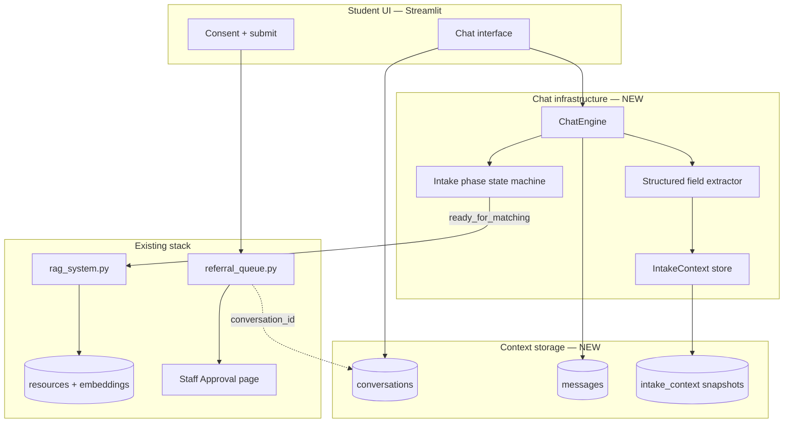
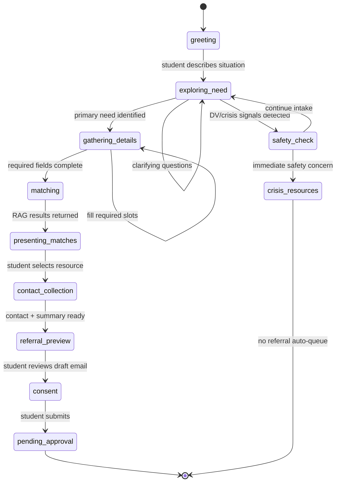
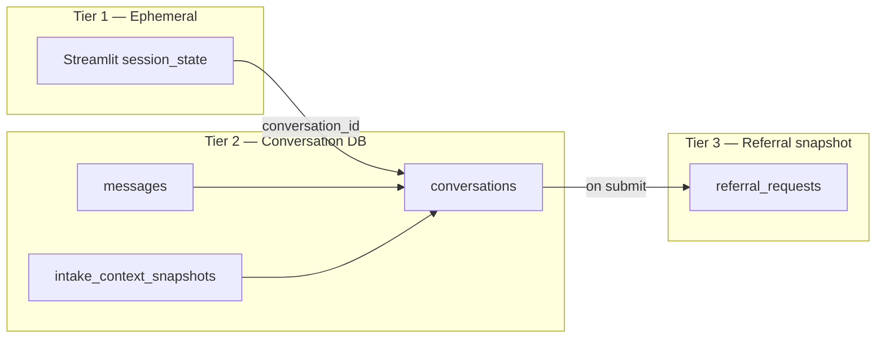

# Technical Scope: Conversational Intake, Chat Infrastructure & Context Storage

This document scopes the engineering work to evolve **Get Help** from a static multi-step form into a **conversational intake chatbot** that discusses the student's needs with AI, accumulates structured context over time, and feeds the existing referral + staff-approval pipeline.

**Related docs:** [PROJECT_PLAN.md](./PROJECT_PLAN.md) (product scope, staff approval, outreach)

**Status:** The form-based intake in `pages/2_Get_Help.py` is an **interim MVP**. This document defines the target architecture to replace it.

---

## 1. Problem statement

| Today (interim) | Target |
| --- | --- |
| Fixed form fields | Adaptive conversation guided by AI |
| Student must know what to disclose upfront | AI asks clarifying questions based on answers |
| `intake_json` built at submit time | `IntakeContext` built incrementally during chat |
| No conversation history | Full transcript stored for staff review |
| Single-shot RAG query from form | RAG invoked when context is sufficient or safety triggers |

The app is no longer only a **search engine**. It becomes a **support conversation surface** that:

1. Builds trust through dialogue
2. Extracts structured intake fields from natural language
3. Retrieves relevant resources mid conversation when appropriate
4. Produces a referral package for mandatory staff approval

---

## 2. System boundaries



**In scope**

- Multi-turn chat UI in Streamlit
- Persistent conversation + message storage (SQLite)
- Rolling `IntakeContext` object updated each turn
- LLM system prompts for WRC-appropriate intake dialogue
- RAG calls triggered by phase rules, not every message
- Conversation summary + transcript attached to referral requests
- Staff reviewer sees chat-derived context (not just form JSON)

**Out of scope (this phase)**

- General-purpose open chat unrelated to intake
- Voice/audio chat
- Real-time websockets (Streamlit rerun model is sufficient for MVP)
- Vector store for conversation history (SQLite text is enough initially)
- Student accounts / login (anonymous `conversation_id` in session)

---

## 3. Intake phase state machine

The chatbot operates in explicit **phases**. The LLM is constrained by phase-specific instructions and tool availability.



### Phase definitions

| Phase | Goal | LLM behavior | RAG allowed? |
| --- | --- | --- | --- |
| `greeting` | Welcome, set tone | Explain process, privacy, staff review | No |
| `exploring_need` | Identify primary need + urgency | Open-ended questions, reflect back | No |
| `safety_check` | Assess immediate danger | Crisis language, offer hotlines | Yes (crisis resources only) |
| `gathering_details` | Fill structured slots | Targeted follow-ups (housing, dependents, deadlines) | No |
| `matching` | Find resources | Summarize understanding, announce search | Yes (full RAG) |
| `presenting_matches` | Explain top matches | Present 1–3 options with rationale | No |
| `contact_collection` | Get outreach contact info | Ask name, safe contact method | No |
| `referral_preview` | Show draft referral | Read-only preview, allow edits to summary | No |
| `consent` | Legal consent | Confirm authorization checkboxes | No |
| `pending_approval` | Hand off to staff | Confirmation message only | No |

Phase transitions are **rule-driven first**, LLM-suggested second. The engine validates transitions in code — the model cannot skip safety or consent phases.

---

## 4. IntakeContext — the structured memory

`IntakeContext` is the canonical structured representation extracted from chat. It is distinct from the raw transcript.

### 4.1 Required fields (matching gate)

These must be populated (or explicitly declined) before `matching` phase:

| Field | Type | Used for |
| --- | --- | --- |
| `primary_need` | enum | RAG query, referral subject |
| `urgency` | enum: crisis / this_week / planning_ahead | Prioritization, safety |
| `need_summary` | string (2–4 sentences) | Referral email body |
| `is_ccsf_student` | enum: yes / no / prefer_not_to_say | Matching boost, referral |

### 4.2 Recommended fields (improve match quality)

| Field | Type | Used for |
| --- | --- | --- |
| `housing_status` | enum | Housing-related queries |
| `has_dependents` | boolean | Childcare, family shelters |
| `deadline` | string? | Urgency framing |
| `language_preference` | string? | Referral note |
| `safe_contact_notes` | string? | Safety, referral |
| `additional_context` | string? | Free-form nuance |

### 4.3 Contact fields (referral gate)

Required before `referral_preview`:

| Field | Type |
| --- | --- |
| `student_name` | string |
| `preferred_contact` | phone / email / either |
| `student_phone` | string? |
| `student_email` | string? |

### 4.4 Safety metadata (system-set)

| Field | Type | Set by |
| --- | --- | --- |
| `safety_review_required` | boolean | `intake/safety.py` rules |
| `safety_flags` | list[string] | keyword + LLM classifier |
| `crisis_detected` | boolean | safety module |

### 4.5 Completeness scoring

```python
completeness = {
    "for_matching": 0.0–1.0,   # required fields for RAG
    "for_referral": 0.0–1.0,   # includes contact fields
}
```

The chat engine uses completeness to decide when to suggest moving forward vs. asking another question.

---

## 5. Chat infrastructure components

### 5.1 Module layout

```
chat/
  __init__.py
  models.py          # Conversation, Message, IntakeContext dataclasses
  store.py             # SQLite CRUD — conversations, messages, context snapshots
  engine.py            # ChatEngine — orchestrates turn processing
  prompts.py           # System prompts per phase
  extractor.py         # LLM structured extraction → IntakeContext
  phases.py            # Phase enum, transition rules
  safety.py            # Re-export / extend intake/safety.py for chat signals
  summarizer.py        # Staff-facing conversation summary
```

### 5.2 ChatEngine turn pipeline

Each student message runs through:

```
1. Persist user message → messages table
2. Load conversation + latest IntakeContext snapshot
3. Run safety scan on new message (keyword + optional LLM)
4. Update safety flags; force safety_check phase if triggered
5. Call extractor: message + transcript window → IntakeContext delta
6. Merge delta into context; persist snapshot
7. Evaluate phase transition rules
8. If phase == matching: call RAG with build_search_query(context)
9. Build LLM messages: system prompt(phase) + context summary + recent transcript + RAG results if any
10. Call LLM → assistant reply
11. Persist assistant message
12. Return reply + UI metadata (matches, phase, completeness)
```

### 5.3 LLM provider

| Option | Pros | Cons |
| --- | --- | --- |
| **Anthropic Claude** (in `requirements.txt`) | Strong safety instruction following | API key, cost per turn |
| OpenAI GPT-4 (`rag_system.py` already supports) | Existing code path | Same cost/key concerns |
| Local model | No API cost | Weaker instruction following for intake |

**Recommendation:** Anthropic `claude-sonnet-4-20250514` (or latest Sonnet) for intake chat; keep local embeddings for RAG search (no change to `rag_system.py` embedding path).

Secrets:

```toml
ANTHROPIC_API_KEY = "..."
# optional fallback
OPENAI_API_KEY = "..."
```

### 5.4 System prompt principles

The WRC intake bot prompt must enforce:

- Warm, non-judgmental tone
- Never promise services or eligibility
- Never provide legal/medical advice
- Ask one or two questions at a time (not interrogation lists)
- Acknowledge crisis signals and surface hotlines
- Remind student that staff review every referral before send
- Do not invent resource contact information — only cite RAG results

Prompts live in `chat/prompts.py` as versioned templates (`INTake_PROMPT_V1`, etc.).

### 5.5 Structured extraction

Two-step extraction (recommended over pure free-form chat memory):

1. **After each user message:** small LLM call with JSON schema output → partial field updates
2. **Before matching:** validation pass ensures enums and required fields

```json
{
  "primary_need": "housing",
  "urgency": "this_week",
  "housing_status": "at_risk_of_eviction",
  "need_summary": "Student facing eviction next month, single parent with one child.",
  "confidence": 0.85,
  "clarifying_question_needed": "Are you currently a CCSF student?"
}
```

Use Anthropic tool use or JSON mode. Invalid enum values are discarded by validator in `extractor.py`.

### 5.6 RAG integration during chat

RAG is **not** called on every message (cost + noise). Triggers:

| Trigger | Action |
| --- | --- |
| Phase enters `matching` | Full semantic search, top 3 |
| Safety phase + crisis keywords | Crisis-filtered search (reuse RAG priority tiers) |
| Student asks "what resources exist for X?" | On-demand search, present in chat |

Search query built from `IntakeContext` via existing `intake/outreach.build_search_query()`.

Results stored in `intake_context.matched_resources` and referenced in assistant message — never hallucinated.

---

## 6. Context storage architecture

Three storage tiers:



### Tier 1: Streamlit `session_state` (ephemeral)

Holds during active browser session only:

```python
session_state = {
    "conversation_id": "uuid",      # links to DB
    "chat_messages_ui": [...],        # display cache (optional)
    "current_phase": "exploring_need",
}
```

Lost on tab close / quick exit. **Quick exit** button clears session_state and optionally marks conversation `abandoned`.

### Tier 2: SQLite conversation store (persistent)

New tables in `wrc_resources.db` (or separate `wrc_intake.db` if policy requires isolation — see §8).

#### `conversations`

| Column | Type | Notes |
| --- | --- | --- |
| `conversation_id` | TEXT PK | UUID |
| `created_at` | TEXT | ISO8601 UTC |
| `updated_at` | TEXT | |
| `status` | TEXT | active / abandoned / submitted / archived |
| `current_phase` | TEXT | state machine position |
| `session_fingerprint` | TEXT? | optional browser hash, not PII |

#### `messages`

| Column | Type | Notes |
| --- | --- | --- |
| `message_id` | TEXT PK | UUID |
| `conversation_id` | TEXT FK | |
| `role` | TEXT | user / assistant / system |
| `content` | TEXT | message body |
| `created_at` | TEXT | |
| `phase` | TEXT | phase at time of message |
| `metadata_json` | TEXT? | RAG ids, safety flags, token usage |

Index: `(conversation_id, created_at)`.

#### `intake_context_snapshots`

| Column | Type | Notes |
| --- | --- | --- |
| `snapshot_id` | TEXT PK | |
| `conversation_id` | TEXT FK | |
| `created_at` | TEXT | |
| `context_json` | TEXT | full `IntakeContext` serialized |
| `completeness_matching` | REAL | 0–1 |
| `completeness_referral` | REAL | 0–1 |
| `trigger_message_id` | TEXT? | which user message caused update |

Only the **latest snapshot** is needed for hot path; keep history for audit/debug (retention policy §8).

### Tier 3: Referral snapshot (immutable handoff)

Extend `referral_requests`:

| New column | Type | Notes |
| --- | --- | --- |
| `conversation_id` | TEXT FK | link to source chat |
| `conversation_summary` | TEXT | staff-facing LLM summary |
| `transcript_excerpt` | TEXT? | last N messages or full transcript per policy |

On submit, copy finalized `IntakeContext` into existing `intake_json` for backward compatibility with Staff Approval page.

---

## 7. Staff approval integration

Staff Approval page gains:

| Section | Source |
| --- | --- |
| Structured intake | `intake_context` / `intake_json` |
| **Conversation summary** | `conversation_summary` (2–3 paragraphs, LLM-generated at submit) |
| **Transcript excerpt** | Expandable full chat (staff only) |
| Safety flags | From context metadata |
| Matched resources + draft email | unchanged |

Summarizer prompt instructs: factual, no embellishment, highlight urgency and safety flags.

---

## 8. Privacy, retention & security

| Topic | Decision needed | Interim recommendation |
| --- | --- | --- |
| Database location | Same file vs. `wrc_intake.db` | Same file for MVP; split if IT requires |
| Transcript retention | 30 / 90 / 365 days | 90 days default, configurable |
| Anonymization | On abandon vs. on submit | Mark `abandoned` conversations for purge job |
| PII in logs | Never log full transcripts to stdout | Redact in application logs |
| Quick exit | Required for survivor safety | Clears session; optional `abandoned` status |
| Staff access | Password page today | Transcript visible only on Staff Approval |
| FERPA | Policy review | Treat transcripts as confidential education records |

**Purge job (Phase 3):** cron or manual script deletes messages + snapshots for conversations older than retention window where `status != submitted`.

---

## 9. Streamlit UI design

### Chat page layout (`pages/2_Get_Help.py` — target)

```
┌─────────────────────────────────────────────┐
│  Get Help — Talk with WRC Assistant         │
├─────────────────────────────────────────────┤
│  [Quick exit]              Phase: Exploring │
│  ┌─────────────────────────────────────┐   │
│  │ Assistant: How can I help today?    │   │
│  │ User: I need housing...             │   │
│  │ Assistant: ...                      │   │
│  └─────────────────────────────────────┘   │
│  [Type your message...            ] [Send]   │
├─────────────────────────────────────────────┤
│  Sidebar: Progress                          │
│  ✓ Need identified                          │
│  ○ Contact info                             │
│  ○ Review & consent                         │
└─────────────────────────────────────────────┘
```

Implementation notes:

- Use `st.chat_message` / `st.chat_input` (Streamlit 1.24+)
- On each send: rerun → `ChatEngine.process_turn()`
- Phase progress indicator in sidebar
- When matches presented: render resource cards inline in chat thread
- Consent step may use structured widgets below chat (checkboxes)

### Streamlit limitations

| Limitation | Mitigation |
| --- | --- |
| Full rerun each message | Keep engine stateless; load from DB by `conversation_id` |
| No true WebSocket streaming | Show spinner during LLM call; optional `st.write_stream` if provider supports |
| Session loss on deploy | `conversation_id` in session_state; future: resume via opaque link |
| Multi-user concurrency | SQLite WAL mode; conversation_id scoped per session |

---

## 10. API & cost estimate

Assumptions: ~8 turns average intake, ~500 input + 200 output.tokens per turn.

| Call type | Calls/intake | Notes |
| --- | --- | --- |
| Chat reply | ~8 | Main conversation |
| Context extraction | ~8 | Parallel or combined with reply |
| Summary at submit | 1 | Staff summary |
| RAG embedding query | 1–2 | Local model, no API cost |

**Cost control:**

- Combine extraction + reply in single LLM call where possible (tool use)
- Cap transcript window sent to LLM (last 12 messages + context summary)
- Cache RAG results per conversation once in `matching` phase

---

## 11. Implementation phases

### Phase A — Storage foundation ✅ (this PR)

- [x] `chat/models.py` — data classes
- [x] `chat/store.py` — SQLite tables + CRUD
- [x] This scope document

### Phase B — Chat engine core

- [ ] `ChatEngine` with phase state machine
- [ ] Anthropic integration in `engine.py`
- [ ] `extractor.py` with JSON schema validation
- [ ] Unit tests for phase transitions (no LLM)

### Phase C — Streamlit chat UI

- [ ] Replace form in `pages/2_Get_Help.py` with chat interface
- [ ] Progress sidebar + quick exit
- [ ] Inline resource cards at `presenting_matches`
- [ ] Consent + submit → `referral_requests` with `conversation_id`

### Phase D — Staff review enhancements

- [ ] Conversation summary on Staff Approval page
- [ ] Expandable transcript
- [ ] Link referral → conversation

### Phase E — Hardening

- [ ] Retention purge script
- [ ] Approver email notification on submit
- [ ] Resume conversation via token (optional)

---

## 12. Open technical decisions

| # | Question | Options | Recommendation |
| --- | --- | --- | --- |
| 1 | Separate intake DB? | Same SQLite / separate file | Same for MVP |
| 2 | One LLM call or two per turn? | Combined / split | Combined with tool use |
| 3 | Store full transcript on referral? | Full / summary only / excerpt | Summary + excerpt (last 20 msgs) |
| 4 | LLM provider | Anthropic / OpenAI | Anthropic primary |
| 5 | Resume abandoned chats? | Yes / no | No for MVP |
| 6 | Moderation API | OpenAI mod / custom keywords | Keywords + safety.py first |
| 7 | Max conversation length | 20 / 40 turns | 30 turns then suggest staff handoff |

---

## 13. Testing strategy

| Layer | Approach |
| --- | --- |
| Phase transitions | Pure unit tests, no API |
| Context extraction | Golden-file JSON fixtures |
| Safety rules | Regression tests on keyword cases |
| RAG integration | Mock `RAGSystem.search` |
| ChatEngine | Integration test with mocked LLM |
| E2E | Manual script: crisis intake, housing intake, incomplete abandon |

---

## 14. Migration from form intake

1. Ship chat UI behind feature flag `USE_CHAT_INTAKE` in secrets
2. Both form and chat write compatible `intake_json` to `referral_requests`
3. Staff Approval unchanged for structured fields; summary appears when `conversation_id` present
4. Remove form code after 2 weeks stable pilot

---

## 15. Summary

Conversational intake requires **three new subsystems**:

1. **Chat infrastructure** — `ChatEngine`, phased prompts, LLM provider, turn pipeline
2. **Context storage** — conversations, messages, `IntakeContext` snapshots in SQLite
3. **Extraction + handoff** — structured fields from dialogue → existing RAG match → existing staff approval queue

The search stack (`rag_system.py`, resource DB) and approval stack (`referral_queue.py`, Staff Approval) remain. The form in `pages/2_Get_Help.py` is a placeholder until Phase C ships the chat UI.

**Next build step:** Phase B — implement `ChatEngine` with phase transitions and Anthropic calls, using the storage layer added in `chat/store.py`.
